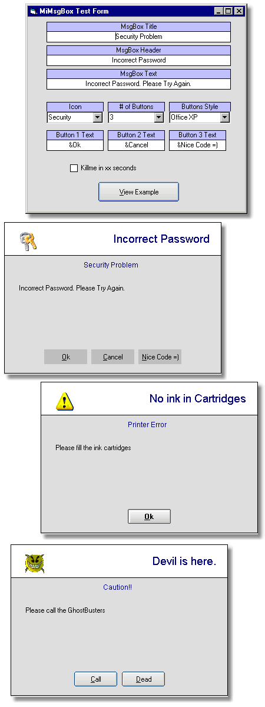



## MiMsgBox v\. 1\.1\.5

### Description

MiMsgBox v. 1.1.5

Visual Design inspired in Kevin Figg's custom MsgBox

but all the code as new, by me.

Super easy to use Custom MsgBox.

Just add one form and one module in your Proyect and call one Function.

If you like, change the form design with your preferences... and i'ts all.

Easy, fast, nice.

Proyect Start - Dec/15/2003

Actual Revision - Jan/24/2004

Comments, sugestions, etc. are welcome.

· Use the gonchuki ChameleonButton and 13 button styles.

· You can set the number of buttons (1, 2, 3 or none)

· Button(s) AutoCentering

· Any text for any button

· Self hiding MsgBox in x seconds
 
### More Info
 

             |
---                |---
**Submitted On**   |2004-01-24 20:12:04
**By**             |[José Luis Farías](https://github.com/Planet-Source-Code/PSCIndex/blob/master/ByAuthor/jos-luis-far-as.md)
**Level**          |Intermediate
**User Rating**    |5.0 (10 globes from 2 users)
**Compatibility**  |VB 5\.0, VB 6\.0
**Category**       |[Custom Controls/ Forms/  Menus](https://github.com/Planet-Source-Code/PSCIndex/blob/master/ByCategory/custom-controls-forms-menus__1-4.md)
**World**          |[Visual Basic](https://github.com/Planet-Source-Code/PSCIndex/blob/master/ByWorld/visual-basic.md)
**Archive File**   |[MiMsgBox\_v1700431272004\.zip](https://github.com/Planet-Source-Code/jos-luis-far-as-mimsgbox-v-1-1-5__1-51284/archive/master.zip)

